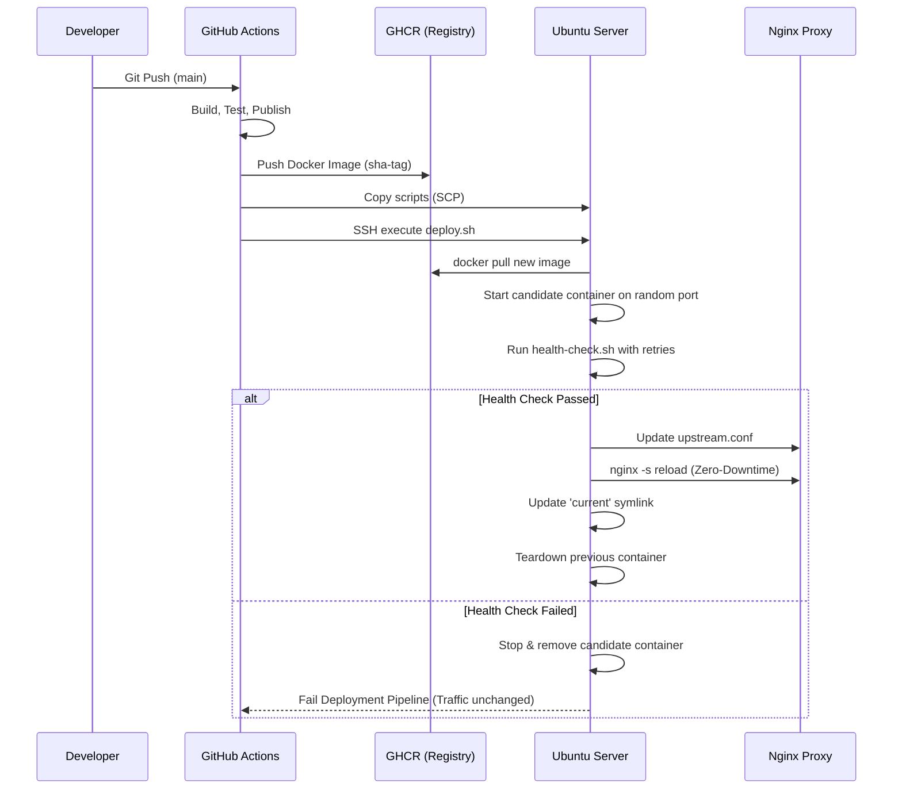

# DeployFlow 🚀 
**Zero-Downtime ASP.NET Core Deployment Framework**

DeployFlow is a production-grade, zero-downtime deployment architecture designed for modern ASP.NET Core applications. It achieves seamless blue/green deployments, automatic failure recovery, and atomic traffic switching on virtual machines without the overhead of Kubernetes.

## 🏗️ Architecture Overview



## 🛠️ Technology Stack
*   **ASP.NET Core 8**: High-performance backend
*   **Docker**: Immutable application packaging
*   **Nginx**: Reverse proxy with atomic configuration reloading
*   **Bash**: Core orchestration scripts
*   **GitHub Actions**: CI/CD automation

## 📂 Repository Layout
*   `src/`: ASP.NET Core 8 Web API source code (featuring a dedicated `/health` endpoint).
*   `docker/`: Multi-stage, non-root `Dockerfile` and Nginx configuration templates.
*   `scripts/`: Core DevOps bash scripts orchestrating the deployment lifecycle.
*   `.github/workflows/`: CI/CD pipeline definition for automated releases.

## ⚙️ Initial Server Setup

To use this framework, you need an Ubuntu server with Docker and Nginx installed.

1. **Install Prerequisites**:
   ```bash
   sudo apt update
   sudo apt install -y nginx docker.io curl
   sudo usermod -aG docker $USER
   ```
2. **Prepare the Capistrano-style Directory Structure**:
   ```bash
   sudo mkdir -p /home/deployer/apps/sample-api/releases
   sudo chown -R $USER:$USER /home/deployer/apps
   ```
3. **Configure Nginx**:
   Copy the provided `docker/nginx.conf` to `/etc/nginx/nginx.conf`. Ensure that `/etc/nginx/conf.d/sample-api_upstream.conf` exists or is automatically created by the deployment script.

## 🔐 CI/CD Configuration (GitHub Secrets)
To enable the GitHub Actions pipeline, configure the following secrets in your repository settings:
*   `SERVER_HOST`: IP address or domain of your target server.
*   `SERVER_USER`: SSH username (e.g., `ubuntu` or `deployer`).
*   `SSH_PRIVATE_KEY`: Private key allowing SSH access to the server.

## 🔄 Deployment Flow Explained
1. A push to the `main` branch triggers the continuous integration pipeline.
2. The code is tested and built into a Docker image, tagged with the exact Git commit SHA.
3. The server downloads the image and spins it up on a random temporary port.
4. `health-check.sh` repeatedly pings the `/health` endpoint with exponential backoff.
5. If the application signals readiness, Nginx is atomically reloaded to point to the new container. The old container is safely stopped.
6. `cleanup.sh` runs automatically, retaining only the 3 most recent deployments to conserve disk space.

## ⏪ Manual Rollback Failsafe
If a regression is discovered after a successful traffic switch, you can instantly revert to the previous known-good release:
```bash
bash /home/deployer/apps/sample-api/scripts/rollback.sh
```
This script restarts the previous container, verifies its health, atomically switches Nginx traffic back, and cleans up the faulty release.
