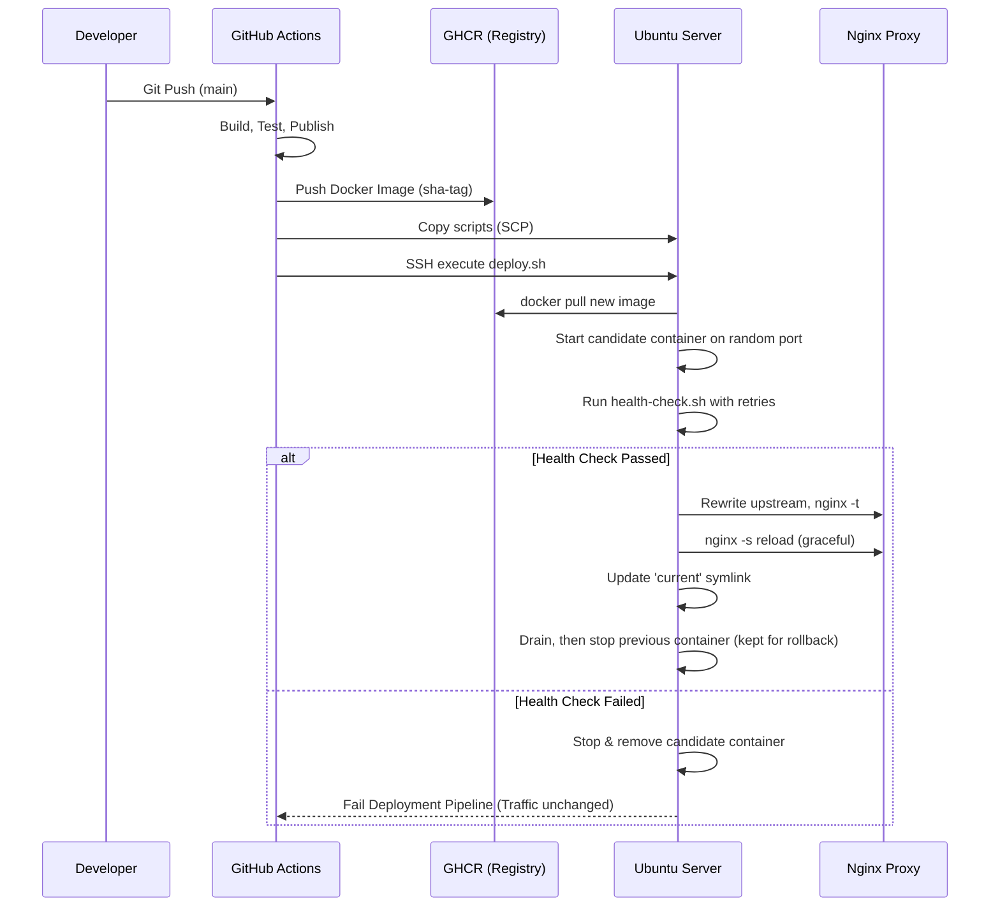

# DeployFlow 🚀
**Blue-Green Deployment for ASP.NET Core on a Single VPS**


**Live demo:** [deployflow.inventstarts.com/version](https://deployflow.inventstarts.com/version) shows the commit currently serving traffic.

DeployFlow is a reference implementation of blue-green deployment for ASP.NET Core on one Ubuntu VM, without Kubernetes. Every push to `main` is built, tested and shipped as a commit-tagged Docker image. The new version starts beside the live one and only receives traffic after it passes a health check. A failed release never reaches users, and one command rolls back to the previous release.

## 🏗️ Architecture Overview



## 🛠️ Technology Stack
*   **ASP.NET Core 8**: High-performance backend
*   **Docker**: Immutable application packaging
*   **Nginx**: Reverse proxy with validated, graceful configuration reloads
*   **Bash**: Core orchestration scripts
*   **GitHub Actions**: CI/CD automation

## 📂 Repository Layout
*   `src/`: ASP.NET Core 8 Web API source code (featuring a dedicated `/health` endpoint).
*   `docker/`: Multi-stage, non-root `Dockerfile` and Nginx configuration templates.
*   `scripts/`: Core DevOps bash scripts orchestrating the deployment lifecycle.
*   `.github/workflows/`: CI/CD pipeline definition for automated releases.

## 🌐 Live Demo & Endpoints

The demo runs at **https://deployflow.inventstarts.com** and exposes diagnostic endpoints so you can check which release is live:

* **`GET /`** - Application Status Overview
* **`GET /version`** - Returns the active Git Commit SHA, Version, and Build Date (proving code changes are live).
* **`GET /health`** - Internal readiness probe endpoint (returns `200 OK` if healthy).
* **`GET /environment`** - Returns the active ASP.NET environment and internal Docker container hostname.
* **`GET /uptime`** - Returns how long the currently active container has been running.

## ⚙️ Initial Server Setup

To use this framework, you need an Ubuntu server with Docker and Nginx installed.

1. **Install Prerequisites**:
   ```bash
   sudo apt update
   sudo apt install -y nginx docker.io curl
   sudo usermod -aG docker $USER
   ```
2. **Prepare the Capistrano-style Directory Structure**:
   ```bash
   sudo mkdir -p /home/deployer/apps/sample-api/releases
   sudo chown -R $USER:$USER /home/deployer/apps
   ```
3. **Configure Nginx**:
   Copy the provided `docker/nginx.conf` to `/etc/nginx/nginx.conf`. It includes `/etc/nginx/conf.d/sample-api_upstream.conf`, which the deployment scripts generate.
4. **Enable HTTPS** (needs a domain pointed at the server):
   ```bash
   sudo apt install -y certbot python3-certbot-nginx
   sudo certbot --nginx -d your-domain.com --redirect
   ```
   Certbot adds the TLS server block and the HTTP→HTTPS redirect, and renews the certificate automatically.

## 🔐 CI/CD Configuration (GitHub Secrets)
To enable the GitHub Actions pipeline, configure the following secrets in your repository settings:
*   `SERVER_HOST`: IP address or domain of your target server.
*   `SERVER_USER`: SSH username (e.g., `ubuntu` or `deployer`).
*   `SSH_PRIVATE_KEY`: Private key allowing SSH access to the server.
*   `GHCR_PAT`: Token with `read:packages`, used by the server to pull the image (logged out after each deploy).

## 🔄 Deployment Flow Explained
1. A push to the `main` branch triggers the continuous integration pipeline.
2. The code is tested and built into a Docker image, tagged with the exact Git commit SHA.
3. The server downloads the image and spins it up on a random temporary port.
4. `health-check.sh` polls the `/health` endpoint up to 10 times at 3-second intervals.
5. If the application signals readiness, the Nginx config is validated and gracefully reloaded to point to the new container. After a short drain period (`DRAIN_SECONDS`, default 10) the old container is stopped but kept, so it can be restarted by a rollback.
6. `cleanup.sh` runs automatically, retaining only the 3 most recent releases (and their containers) to conserve disk space.

## ⏪ Manual Rollback Failsafe
If a regression is discovered after a successful traffic switch, you can revert to the previous release:
```bash
bash /home/deployer/apps/sample-api/scripts/rollback.sh
```
The script finds the release before the one `current` points to and restarts its stopped container. If that container is gone or can't get its port back, it recreates it from the release's recorded image (the image must still be on the server, or the server must be logged in to GHCR). It then verifies health, switches Nginx traffic back, and removes the faulty release. Running it again steps back one more release.

## 📏 Measuring Downtime
To see what clients experience during a switch, run this from any machine while a deploy or rollback happens:
```bash
bash scripts/measure-downtime.sh https://deployflow.inventstarts.com 180 8
```
It sends continuous requests to `/version` from parallel workers and reports total requests, failed requests, and the moment the served commit changed.
